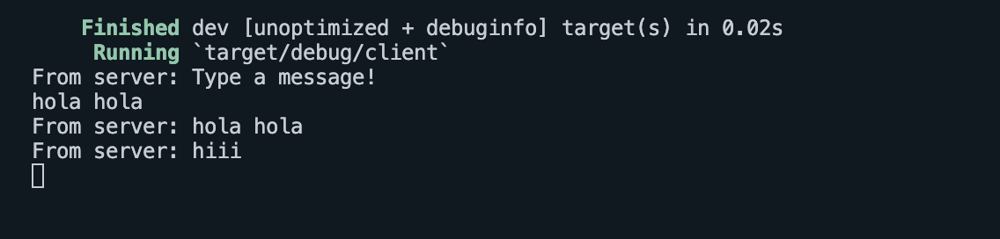

### Experiment 2.1: Original code, and hownit run

Berikut langkah-langkah dan penjelasannya:

Menyiapkan Server dan Client:
Pertama, buka empat terminal pada sistem operasi yang digunakan. Satu terminal akan berfungsi sebagai server, dan tiga terminal lainnya sebagai client.

Menjalankan Server:
Pada terminal pertama, jalankan server dengan mengetikkan perintah `cargo run --bin server`.
Setelah dijalankan, server akan mendengarkan pada port 2000. Server akan menampilkan pesan "listening on port 2000" sebagai tanda bahwa server sudah siap menerima koneksi dari client.

Menjalankan Client:
Pada masing-masing dari tiga terminal lainnya, jalankan client dengan perintah `cargo run --bin client`.
Setiap client yang terhubung akan mendapat pesan dari server "From server: Type a message!" sebagai instruksi untuk mulai mengetik pesan.

Mengirim dan Menerima Pesan:
Ketika kita mengetikkan pesan di salah satu client (misalnya, "halo halo" di client pertama), pesan tersebut akan dikirim ke server.
Server kemudian akan menerima pesan tersebut dan menyiarkannya ke semua client yang terhubung.
Setiap client akan menerima pesan yang dikirim oleh client lain. Misalnya, ketika client pertama mengetik "halo halo", pesan ini akan muncul di semua client lain, ditandai sebagai "From server: halo halo".

Observasi pada Setiap Client:
Client 1: Setelah mengetik "halo halo", client ini akan menerima pesan tersebut kembali dari server, diikuti oleh pesan lain dari client lain ("hola hola" dan "hiii").
Client 2: Setelah mengetik "hola hola", pesan ini juga diterima kembali dari server, dan pesan selanjutnya adalah "hiii" dari client ketiga.
Client 3: Hanya mengetik "hiii" dan menerima pesan yang sama kembali dari server.

### 2.2. Modifying the websocket port
Ini merupakan file yang saya ubah untuk mengganti port:
client.rs:

server.rs:

Perubahan:

Dapat dilihat dari keempat gambar tersebut bahwa yang berubah hanya port nya saja tanpa mengubah logic dari program karena masih menggunakan konfigurasi yang sama.